# Plan completo de implementación de Jutsu Invoker

Revisión del 4 de octubre de 2026 para `~/Proyectos/Jutsu-Invoker`. Objetivo: reconocer mono, tigre, caballo y serpiente desde el Android por USB, construir las diez recetas y conservar buena respuesta mientras Dota comparte la RTX 4060.

**El primer motor será YOLOX-Nano ya entrenado para sellos Naruto.** La [nueva investigación de repositorios japoneses, chinos y comparadores](investigacion/REPOS-SELLOS-PREENTRENADOS.md) demuestra que existe un checkpoint reutilizable. RTMPose + apariencia + TCN pasa a ser una ampliación condicionada a pruebas. La [investigación de articulaciones y oclusiones](investigacion/VISION-Y-OCLUSIONES.md) conserva su valor para esa etapa.

**Construido:** entrenador Android USB con servidor scrcpy 4.1 verificado, NVDEC, BGR/letterbox/NMS CUDA, TensorRT 11.3 FP32, aceptación temporal, diez recetas, controles y grabación H264 etiquetada. La prueba frontal procesó 360 imágenes en 12 segundos a ~30 FPS, con procesamiento p95 7,53 ms; informe real (`runtime/live-validation.json`, informe local no versionado). Pilotos propios de poses: 8/10 y 9/10. Primera prueba de recetas: 0/10; tras ajustes se obtuvieron 8/10 y 9/10 recetas (la última provisional, antes del perfil de mono y 1,6 s). [Revisión de calibración](REVISION-Y-CALIBRACION.md). La integración GSI/uinput está implementada con selección progresiva de orbes; [estado y evidencia](DOTA-INTEGRACION.md). Vídeo real verificado en la sesión existente de Chrome; cámara trasera 720p30 y decoder compatible del navegador. Se agregó un piloto guiado con informes, confusión y grabación. Los umbrales personales siguen sin calibrar.

## Decisiones vigentes

| Aspecto | Decisión |
|---|---|
| Asignaciones | Mono = Quas; tigre = Wex; caballo = Exort; serpiente = confirmar |
| Primer reconocedor | Kazuhito00 YOLOX-Nano ONNX, revisión fijada, 416×416, imagen conjunta |
| GPU de desarrollo | ONNX Runtime CUDA FP32 con I/O Binding y perfil; fallback CPU deshabilitado |
| Runtime actual | TensorRT 11.3 FP32 validado; FP16 opcional después de paridad |
| Cámara | HONOR Android 13 por USB; ambas cámaras 720p30 verificadas; este teléfono no anuncia 60 FPS |
| Transporte / decoder | scrcpy servidor fijado + receptor de paquetes propio → PyNvVideoCodec/NVDEC |
| Tiempo | Máquina de estados con timestamps, frescura, estabilidad, score y margen |
| Datos | Capturas propias para evaluar primero; ajustar pesos solo si hace falta |
| Ampliaciones | RTMPose Hand5 y fusión ligera; clasificador Sealwork como comparador compatible con su extractor |
| Primera salida | Entrenador local, con motivos de rechazo y receta; integración al juego en una fase posterior |

No confundir un detector de articulaciones con un clasificador ya entrenado para Naruto. El proyecto chino NARUTO-CODING contiene el mismo modelo que Kazuhito, comprobado por Git blob: no aporta un checkpoint independiente. PINTO ofrece landmarks ONNX y herramientas útiles, pero su cabeza original reconoce mano abierta, cerrada y dedo apuntando.

El clasificador bimanual Sealwork pesa 269 KB y distingue doce sellos más transición, pero usa MediaPipe y datos de una persona. No alimentarlo con RTMPose 2D y `z=0` esperando equivalencia. Sus pesos, su espejo y su normalización deben probarse como un conjunto. No hay evidencia suficiente para cambiar a él sin evaluación.

## Arquitectura inicial y ampliaciones

```mermaid
flowchart LR
    A[Android: H264 por USB] --> B[Paquetes scrcpy y PTS]
    B --> C[NVDEC: buffers CUDA]
    C --> D[Color BGR y letterbox CUDA]
    D --> E[YOLOX de sellos: GPU]
    E --> F[Decodificación y NMS CUDA]
    F --> G[Evidencia reciente: score y margen]
    G --> H[Aceptación temporal]
    H --> I[Gramática compacta]
    I --> J[Entrenador local]
```



La CPU gestiona USB/socket, paquetes comprimidos, estados y mensajes pequeños. Las imágenes, conversiones, recortes y redes permanecen en GPU en el camino final. Cargar una imagen con OpenCV y subirla una vez a CUDA es un diagnóstico disponible hoy, no una implementación de captura GPU ni un fallback de vídeo.

Si el primer detector cumple la evaluación, esta arquitectura basta. Si no, comparar en clips idénticos: RGB personalizado; puntos RTMPose; RGB + puntos; y fusión temporal causal. La apariencia conjunta debe conservar contacto y contorno aunque se pierda una mano. Una TCN pequeña de cuatro, seis u ocho observaciones pasadas se agrega únicamente si reduce errores de secuencia. No usar frames futuros.

WiLoR `--fast` y OmniHands quedan como comparadores bajo errores persistentes de oclusión, con revisión de sus dependencias/licencias y coste. StableHand y PAD-Hand aportan investigación, pero sus demos por clips no constituyen un motor de webcam de baja latencia. Ejecutar una arquitectura elegida durante el juego; no acumular comparadores en producción.

## Contrato del checkpoint: obligatorio antes de inferir

[Manifiesto del modelo](modelos/manifiesto-naruto.json), [procedencia y revisión](diseno/modelo-referencia.json).

- Entrada `[1,3,416,416]` FP32: **BGR 0–255**, relleno 114, resize bilineal uint8, imagen arriba a la izquierda. No aplicar normalización ImageNet ni dividir por 255.
- Salida real inspeccionada `[1,3549,21]`: cuatro coordenadas, objectness y dieciséis scores. Strides 8/16/32 y decodificación YOLOX, seguida de NMS.
- La demo usa `labels[class_id + 1]`; el CSV contiene `None` al principio. IDs reales: **tigre 2, serpiente 5, caballo 6, mono 8**.
- El canal 15 no tiene nombre en el CSV: `unmapped_15`, siempre desconocido. Las otras clases siguen compitiendo contra nuestros cuatro sellos. No elegir exclusivamente entre Q/W/E/R.
- Los scores del detector no están calibrados como probabilidad de comando correcto. La existencia de pesos públicos no garantiza cobertura de nuestras manos, luz, mangas o cámara.

Descargar de una revisión fija, comprobar tamaño y Git blob y calcular SHA256. Conservar licencia MIT original. No copiar GUIs con envío de teclas para arrancar el reconocedor. Las restricciones de otros proyectos/datasets se revisan si se incorporan.

## Fase 0 — Entorno y contrato reproducibles

**Avance real:** entorno `.venv` Python 3.12.13; dependencias CUDA 12.9 de usuario, ORT GPU 1.26.0 y CuPy 14.2.0; modelo, CSV y licencia descargados y verificados. `requirements-gpu.lock` fija las dependencias instaladas. La elección de Python 3.12 usa un intérprete ya disponible y compatible con estos paquetes; no modifica el Python del sistema ni el driver.

La prueba inicial de treinta repeticiones sintéticas 720p en RTX 4060 dio p50 5,08 ms y p95 11,11 ms con perfil activo. Incluye resize, red, NMS y metadatos al host; todos los eventos de nodos registrados usan CUDA. El resize difiere de OpenCV en como máximo un nivel uint8. Informe (`runtime/smoke-naruto-cuda.json`, informe local no versionado). Los tiempos son una comprobación inicial, no un benchmark de juego.

**Validado:** TensorRT 11.3.0.99 y PyNvVideoCodec 2.2.3 ejecutados, paridad TensorRT/ORT (`runtime/paridad-tensorrt.json`, informe local no versionado), NVDEC con cámara real (`runtime/smoke-nvdec.json`, informe local no versionado). Engine de ~26 MB asociado a modelo/GPU/runtime; FP32 sin TF32. Una consulta del proceso tras reiniciar mostró ~190 MiB, sin medir pico compartiendo GPU con Dota. FP16 no está habilitado; FP32 ya cumple el objetivo inicial de procesamiento sin juego.

**Salida:** entorno reproducible, manifiesto, diagnóstico CUDA verificable y compatibilidad del decoder/runtime. Una biblioteca GPU ausente genera error; no habilitar ejecución pesada en CPU automáticamente.

## Fase 1 — Cámara USB y buffers GPU

**Implementado:** `src/jutsu_invoker/camera.py` y `nvdec.py`. HONOR TFY-LX3, Android 13; frontal y trasera permiten 1280×720 a 30 FPS, sin modo 60 FPS anunciado. Reutiliza autorización ADB existente, crea forward/jar únicos y los retira al cerrar. Servidor scrcpy 4.1 descargado del release oficial y verificado por SHA256; el receptor aplica ese protocolo, sin requerir cliente de escritorio.

La prueba real confirmó H264 sin B-frames. NVDEC de baja espera entrega RGB en CUDA; se obtiene por DLPack y se crea una copia BGR contigua propia antes de reciclar la superficie. Las conversiones y sincronización permanecen en GPU. Prueba NVDEC (`runtime/smoke-nvdec.json`, informe local no versionado): 287 frames, ~30 FPS, p95 5,40 ms para decode/conversión/copia. Ese tiempo no se suma automáticamente al p95 de otras pruebas para estimar latencia total.

**Pendiente de evaluación:** diez minutos con luz/encuadre definidos, exposición, temperatura y batería. PTS se alinea por offset mínimo observado para medir crecimiento relativo de cola; no se presenta como latencia absoluta de sensor.

Mantener **un frame decodificado pendiente para inferencia**, sustituyéndolo por el más reciente. Consumir los paquetes H264 necesarios: descartar paquetes arbitrariamente rompe dependencias. Ante cola excesiva, reiniciar desde un punto decodificable. Desconexión, cambio de tamaño, reloj o sesión cancela receta e historial.

**Salida:** tensor CUDA desde cámara, cadencia/edad registradas y decoder hardware comprobado, sin ruta sostenida de vídeo por OpenCV/NumPy. V4L2 queda como diagnóstico auxiliar.

## Fase 2 — Piloto con pesos existentes

**Conectado:** el frame BGR CUDA alimenta TensorRT en `live.py`. Mantener un área fija frente al torso y margen para ambas manos. El detector ya reconoce el sello conjunto: no exige dos cajas de palma ni dos esqueletos para funcionar.

**Implementado:** panel local en `http://127.0.0.1:32147/` con sello, score, cadencia, fórmula, receta y rechazo; detener/reconectar, selección de cámara y tomas. Vista opcional WebCodecs con preferencia hardware, reutilizando H264 en lotes breves con cursor/generación y GOP completo al reconectar. La captura/inferencia trabaja a 30 FPS; el navegador decodifica esa cadencia y se puede ocultar la vista. No hay JPEG completo ni recodificación software por frame. El render final del vídeo fue verificado en Chrome con manos reales. Baseline/Level 3.1 solicitado al encoder; si Chrome no admite preferencia hardware, usa su decoder compatible, independientemente del reconocimiento GPU. No afirmar aceleración del render sin comprobarla en el navegador de uso.

Conservar clases originales y detectar ambigüedad entre cajas. El preprocesamiento y NMS del prototipo están en CUDA; solo vuelven al host metadatos pequeños. Comparar salidas contra la referencia original en clips y documentar diferencias de bilinear/NMS antes de congelar el motor.

El engine TensorRT FP32 se construye fuera de la sesión de uso y se calienta antes de abrir la cámara. Exigir paridad registrada para el modo en vivo; comparar FP16 si se necesita reducir más el coste. El engine queda asociado al hash del modelo, formas, GPU y runtime. No copiar opciones antiguas de precisión sin comprobar la API de la versión elegida. [TensorRT](https://docs.nvidia.com/deeplearning/tensorrt/latest/).

**Salida:** entrenador real con cuatro sellos y desconocido, una observación por imagen fresca y un motor GPU probado. No anunciar articulaciones ni un checkpoint personalizado que todavía no existen.

## Fase 3 — Datos y decisión de reutilización

Evaluar el detector sin ajuste con tres sesiones separadas: cuatro sellos sostenidos, doce transiciones dirigidas, diez recetas y negativos de uso normal: teclado, ratón, cara, brazos y reposo. Piloto: veinte ejecuciones por sello/sesión, diez por transición/sesión y varios minutos de negativos. Adaptar cantidades según errores; no son una garantía estadística.

**Herramienta implementada:** piloto guiado de sellos/reposo (dos rondas, 80 s) o diez recetas, referencias sobre el vídeo, exclusión de ejecuciones no realizadas, JSONL de observaciones y reporte de confusión/errores. Graba la sesión y conserva vínculo al clip. Resultado provisional hasta confirmar las poses; no es verdad independiente ni validación entre sesiones. Exige ≥75% de captura, ≤5% de imágenes obsoletas y ≥80% de consistencia por intento; informa exclusiones junto a aciertos. No cambia umbrales automáticamente.

Grabación H264 sin recodificación y sidecar con etiqueta elegida, sesión, PTS, offsets y frames; validada una toma de 328 imágenes. Todavía no constituye una evaluación de sellos. Etiquetar inicio/fin, sello, transición, desconocido y oclusión visible. Dividir por sesión o toma completa, nunca mezclando frames vecinos en entrenamiento y evaluación. Mantener un conjunto final que no se use para elegir umbrales.

Medir recetas completas, rechazos, cobertura, confusión caballo/tigre, pérdidas de mono y falsos confirmar. Revisar cierres transitorios parecidos a serpiente. No inventar verdad 3D para dedos tapados.

**Decisión:** si el checkpoint cumple, conservarlo y omitir entrenamiento obligatorio. Si falla por iluminación/ropa/escala, personalizar RGB. Si persiste confusión por interacción, comparar la ampliación geométrica. Guardar informe que justifique cada nueva red.

## Fase 4 — Personalización y oclusiones, si hacen falta

Ajustar un detector o clasificador RGB compacto en GPU; MobileNetV3-Small ImageNet es una inicialización, **no pesos Naruto**. Incluir cuatro sellos, transición y desconocido. Los aumentos sintéticos complementan capturas reales; no las sustituyen. Entrenar y compilar fuera del juego.

Si los puntos ayudan, incorporar RTMDet-nano de manos + RTMPose-m Hand5, entradas 256×256 y dos recortes. Descargar artefactos oficiales con hashes y normalización documentados. Comparar batch 1/2 sin esperar el frame siguiente y resolver SimCC/remapeo/NMS en CUDA. Medir frecuencia de detector reducida, por ejemplo 20 Hz, sin imponerla si perjudica la oclusión.

Mantener identidad por continuidad y lateralidad; ordenar cajas por X cambia identidades al cruzar manos. Resolver espejo una vez. Conservar posición relativa de muñecas en coordenadas de imagen además de geometría normalizada por mano. Una confianza alta no demuestra visibilidad de cada dedo. Reducir peso de puntos ausentes o inestables y permitir rechazo.

Comparar RGB, puntos, fusión y fusión causal sobre los mismos clips. Si se prueba Sealwork, respetar MediaPipe/normalización originales o reentrenar con el extractor nuevo. Las mallas plausibles de WiLoR tampoco prueban la postura de dedos ocultos. Una segunda vista oblicua se considera si la información distintiva no existe en el frontal.

**Salida:** mejora demostrada de recetas/falsos confirmar que compense tiempo y memoria; un único motor seleccionado. Si no mejora, conservar la variante simple.

## Fase 5 — Aceptación y gramática

**Implementado:** núcleo en `src/jutsu_invoker/recognition.py`, CLI de replay y pruebas automatizadas. Mantener el sello no añade tokens; tres elementos distintos producen QWE, un elemento produce AAA y dos distintos AAB con predominio del primero. Serpiente confirma una receta pendiente una sola vez. Un selector ya elegido se ignora sin repetirlo ni cancelar la fórmula. [Diez recetas](diseno/mapa-recetas.json).

Parámetros iniciales, **sin calibrar**: score ≥0,8 y margen ≥0,15; estabilidad ≥150 ms y cinco observaciones frescas para elementos; ≥200 ms y siete para serpiente. Rechazar timestamps repetidos, no finitos, futuros, evidencia no visual y datos de más de 100 ms. Un hueco de más de 100 ms reinicia la estabilidad de la pose, sin borrar los selectores aceptados hasta el plazo de inactividad. Ajustar estas cotas con la cámara real; no se deducen de FPS aislados del modelo.

Una señal explícita desconocida/transición durante ≥50 ms y al menos dos imágenes libera el sello mantenido; una fluctuación breve no lo repite. Receta caduca 1.600 ms (valor solicitado por el usuario; el piloto anterior usaba 3.000 ms) desde la última evidencia fiable de un selector guardado; mantener la pose renueva actividad, y desconocido no renueva el plazo. La integración de cámara cancela al detener, cambiar sesión, desconectarse o agotar el plazo sin imágenes fiables, y atiende huecos aunque no lleguen imágenes. Controles y reinicio real comprobados. No confirmar con puntos extrapolados.

La gramática compacta no corrige tokens perdidos: omitir tigre en mono→tigre→serpiente puede formar otra receta válida. Medir secuencias completas y no ocultar estos errores con exactitud por frame. La vista del entrenador conserva rechazos y cancelación manual. Un modo literal sería posterior y separado.

**Validado:** diez recetas en pruebas/replay, frescura, huecos, estabilidad, liberación, transporte fragmentado, límites, GOP, grabación y controles HTTP: 40 pruebas, incluyendo evaluación, exclusiones y protocolo. Reconexión real comprobada. **Pendiente:** diez recetas con sellos propios, falsos positivos y cobertura real.

## Fase 6 — Evaluación compartiendo GPU con Dota

Primero medir sin juego; después con una escena repetible de Dota y ajustes fijos. Registrar VRAM adicional total, CPU de app/puente, FPS y tiempos de frame p95/p99 del juego, cadencia/edad de cámara y latencia de sello formado hasta evento. Usar eventos CUDA y reloj monotónico; PTS Android y reloj PC no son directamente restables sin alineación o referencia externa.

Si la GPU se satura, reducir visualización, frecuencia o cadencia y volver a medir. No trasladar redes a CPU como fallback automático. Prioridades CUDA no reservan GPU frente al juego. Publicar exactitud junto a cobertura/rechazos para que rechazar todo no parezca éxito.

| Medida | Objetivo inicial, pendiente de prueba real |
|---|---|
| Sello formado→evento p95 | ≤150 ms, incluyendo cámara y estabilidad |
| Procesamiento GPU p95 con Dota | Intentar ≤20 ms para toda la ruta |
| VRAM adicional | Intentar ≤1,5 GiB, runtime y buffers incluidos |
| CPU de app y puente | Intentar ≤0,5 hilo lógico medio |
| FPS mediano de Dota | Pérdida <5%; examinar también extremos de tiempos de frame |
| Recetas completas | ≥95% en piloto; buscar ≥99% en sesiones nuevas antes de uso habitual |
| Falsos confirmar | Cero en ensayo inicial; publicar tasa por hora y ampliar horas |
| Datos obsoletos/desconexión | Cancelación sin nuevos comandos |
| Ejecución | Decoder, imágenes y redes GPU comprobados |

**Salida:** motor seleccionado y configuración medida. Las cifras de la prueba sintética inicial no satisfacen por sí solas estos criterios.

## Fase 7 — Integración con Dota

**Implementada y opcional:** `live --dota` habilita GSI local; **Activar invocación** crea el teclado virtual limitado a las teclas verificadas de orbes, Invoke y selección (Q/W/E/R y 2 en esta máquina), sin D/F. El entrenador sin `--dota` conserva su salida local. Se envían las teclas normales leídas de tu configuración; no hace falta consola ni otro archivo de binds y no se sobrescriben controles personales. Dota necesita `-gamestateintegration`, según [Valve](https://www.dota2.com/newsentry/4491783379124370818).

Cada selector aceptado coloca un orbe inmediatamente. Serpiente completa los recuentos que faltan y ejecuta Invoke: Q→W→R produce Q, W, Q+Invoke (Ghost Walk); W→Q→R produce W, Q, W+Invoke (Tornado). Tres selectores distintos completan QWE en cualquier orden. Un sello mantenido no genera repeticiones. Las diez recetas y órdenes distintos están comprobados automáticamente.

La elegibilidad exige propio Invoker, vivo, sin silencio/stun/hex, sesión pregame/en curso, sin pausa, estado GSI reciente, cámara fresca, ranuras estándar y foco real del proceso Dota. No se restringe por modo; modos con habilidades reordenadas quedan suspendidos. Los orbes necesarios deben estar aprendidos y disponibles. Se pueden colocar mientras Invoke está en cooldown; la confirmación se rechaza hasta que esté listo, sin cola ni reintento automático. Cada envío selecciona al héroe para evitar dirigir habilidades a unidades secundarias.

Un contador XI2 sin captura exclusiva detecta entrada manual y modifica la confianza del prefijo. Si se cambian orbes/selección entre sellos, se reconstruyen tres orbes antes de R. Si ocurre entrada manual durante el envío, se aborta. El transporte directo requiere XI2 para separar pulsaciones propias y manuales y suspender sellos al abrir chat/consola; no se activa sin él. Pérdida de foco/estado, cámara detenida, cancelación y timeout eliminan el prefijo. Un corte breve de vídeo solo descarta evidencia incompleta y suspende el envío hasta recibir imagen fresca. Los orbes colocados no se revierten. La comprobación GSI espera el hechizo en la ranura D; no confundir uno ya preparado con una invocación nueva.

**Alcance:** únicamente orbes e Invoke; el dispositivo virtual carece de teclas de lanzamiento D/F. Los bindings normales permanecen sin cambios. No hay automatización de puntería ni casting. El modo activado permanece hasta desactivarlo o hasta un fallo sin confirmación, pero se suspende mientras Dota no sea elegible. Evaluaciones y cambios de ajustes lo desactivan.

**Evidencia:** informe de juego (`runtime/dota-live-validation.json`, informe local no versionado) distingue las pruebas reales en Demo Hero de la cobertura simulada. Otros modos no se han probado individualmente; benchmark de FPS del juego y temperatura sigue pendiente. [Guía vigente](DOTA-INTEGRACION.md).

## Ejecutar lo construido y siguiente paso

```bash
cd ~/Proyectos/Jutsu-Invoker
scripts/run_trainer.sh --camera front
# Panel: http://127.0.0.1:32147/
```

El entorno, pesos, servidor y engine ya están preparados. [README](README.md) documenta reproducción completa y diagnósticos. El siguiente paso es usar las tomas etiquetadas para medir los cuatro sellos y las diez recetas en sesiones propias. No se necesita entrenar toda la fusión para probar los pesos existentes. La etiqueta seleccionada requiere revisión y no es verdad automática.

Este directorio es la ubicación principal. Los respaldos previos siguen en `.archivo/`; esta carpeta no tiene metadatos Git en la revisión actual. Las especificaciones ejecutables y su estado están en [config/desarrollo-gpu.toml](config/desarrollo-gpu.toml) y [diseno/pipeline-vision.json](diseno/pipeline-vision.json).

### Actualización tras cámara: articulaciones y transiciones

RTMDet-nano Hand + RTMPose-m Hand5 activos como diagnóstico CUDA, hasta dos manos y 21 joints, overlay asociado a PTS; fusión desactivada. Descarga verificable y derivación de grafos en scripts/download_hand_models.py y scripts/prepare_hand_models.py. Perfiles GPU y paridad de preprocesamiento en runtime/articulaciones-validacion.json. Ver [revisión](REVISION-Y-CALIBRACION.md): replay 3/10 en los datos anteriores y Cold Snap interactivo confirmado; falta una toma nueva de las diez recetas. No se usan articulaciones inciertas para emitir comandos.

Configuración actual de cámara: captura rotada 180° en el servidor del Android, incluyendo modelos y grabación. Refinamiento limitado de tigre/carnero por consenso de espejo y contexto con scores ≥0,85; datos originales conservados y objetivos de evaluación excluidos del reconocedor. Piloto posterior a la corrección temporal: 8/10 recetas. Refinamiento de tigre validado retrospectivamente; falta ensayo nuevo y negativos de carnero.


### Ajustes personales y fluidez del vídeo

Perfil solicitado: reinicio por inactividad 1.600 ms; mono score ≥0,75, estabilidad 100 ms y cuatro imágenes frescas; tigre/caballo conservan 0,8, 150 ms y cinco imágenes, serpiente conserva 0,8, 200 ms y siete. Margen 0,15, frescura y huecos 100 ms. Son candidatos nuevos, todavía sin medir en un piloto posterior. El último piloto previo dio 9/10 recetas, provisional.

Panel accesible **Ajustes de detección y vídeo**, con básicos visibles y **Más ajustes**, guardado local atómico y restauración a recomendaciones. `config/usuario.json` prevalece sobre el TOML base. Cambios aplicados entre imágenes, cancelación de receta pendiente; orientación reinicia captura. Pruebas de precisión bloquean cambios y esperan a que los pendientes se apliquen antes de iniciar.

WebCodecs presenta imágenes decodificadas por PTS con `requestAnimationFrame`, búfer 60 ms configurable, cola máxima de ocho imágenes y descarte solo de imágenes ya decodificadas. Se preservan dependencias H264; la presentación se pausa al ocultar la pestaña. DOM de receta/historial se reconstruye solo al cambiar sus datos. Medición Chrome de una ventana: intervalo p95 de 91,2 a 33,4 ms a ~30 FPS; evidencia (`runtime/preview-fluidity.json`, informe local no versionado). Validación: 48 pruebas Python y 5 Node; no sustituye ensayos nuevos de precisión o juego.

## Corrección de cortes breves y avisos de sello · 2026-10-04

Se corrigieron las cancelaciones adelantadas de pares como caballo→tigre: el corte >100 ms no borra E/W antes del timeout configurable de 1,6 s. El envío mantiene su límite estricto de frescura; ante interrupción invalida el estado de orbes y exige una confirmación nueva para reconstruirlos. La percusión original de cada aceptación tiene volumen y silencio persistentes; se entrega por SSE para funcionar con Dota al frente. Suite: 93 Python + 10 Node. Chat real comprobado por el usuario; prueba real del par y sonido pendiente al escribir esta sección.

Comprobación posterior real: Chaos Meteor confirmado por GSI tras E→W→E→R; la repetición quedó `already_available` sin repetir Invoke. Ice Wall y Deafening Blast también observados. Los diez hechizos constan ahora en el historial directo acumulado de Demo Hero; no se presenta como piloto etiquetado 10/10. Escucha del sonido pendiente de confirmación del usuario.

### Audio ajustado tras la escucha del usuario

El usuario confirmó que el par conserva sus elementos y prepara Chaos Meteor, pero pidió el efecto del anime y más volumen. Se sustituyó el sintetizador por dos recortes con [procedencia documentada](referencias/audio/PROVENANCE.md): 260 ms para sello aceptado y 560 ms para hechizo preparado, precargados desde loopback; volumen inicial y actual 65 %. En modo Dota la confirmación depende de GSI o del hechizo ya disponible en D, sin sonido de éxito al reconocer una receta cuyo envío falla. En modo local confirma la receta. Canal SSE y sondeo comparten identidad para evitar duplicados. 94 Python + 12 Node pasan. Escucha final de los clips pendiente.

### Recortes del mismo clip de cinco golpes

El usuario pidió que los tres primeros sonidos de Naruto hand signs acompañen las posturas y su remate final confirme Invoke. Se aislaron 1→mono (256 ms), 2→tigre (354 ms), 3→caballo (208 ms) y 5→confirmación (615,125 ms), omitiendo 4. Serpiente no suena antes de la confirmación del juego. Se conserva la preferencia de volumen de Chrome (100 % al cargar los recortes; valor inicial 65 %), la entrega SSE y el bloqueo de sonidos repetidos. Cortes, niveles y hashes (`runtime/audio-cuts-validation.json`, informe local no versionado); [procedencia](referencias/audio/PROVENANCE.md). Suite: 94 Python + 13 Node.


### Cuarto golpe para serpiente y remate al lanzar · 2026-10-04

El usuario cambió la asignación: se añadió el cuarto golpe (1,292–1,528 s, 236 ms) a serpiente cuando acepta una receta válida. El quinto ya no acompaña Invoke ni un hechizo disponible en D: espera el lanzamiento manual con D/F, inferido del inicio de recarga o del consumo de una carga en GSI. La comparación sigue la identidad del hechizo en D/F y descarta el estado inicial, la recarga ya en curso, cambios de sesión y datos antiguos. No envía teclas de lanzamiento. Sin cambios de recarga/cargas (Free Spells), no genera remate; el entrenador local conserva solo los cuatro golpes de posturas. Los cinco WAV están precargados en Chrome y se conserva el volumen del usuario (100 %, valor inicial 65 %). Suite: 100 Python + 13 Node. La escucha y el lanzamiento manual reales de este cambio están pendientes de respuesta; los diez hechizos preparados previamente siguen siendo evidencia distinta. Cortes (`runtime/audio-cuts-validation.json`, informe local no versionado), [procedencia](referencias/audio/PROVENANCE.md), [integración](DOTA-INTEGRACION.md).

Comprobación real posterior: GSI registró inicio de recarga de Chaos Meteor, Ghost Walk y EMP en D, y Tornado en F. El enlace no emitió D/F. Estos son eventos de lanzamiento distintos de las confirmaciones de preparación; la escucha del remate queda pendiente del usuario.

El usuario confirmó la escucha del cuarto golpe en serpiente y del quinto al lanzar manualmente. A petición suya se redujo solo la ganancia del remate de 0,95 a 0,72 (24 % menos, −2,4 dB); los sellos y el volumen general conservan su nivel.


### Respuesta de tigre · 2026-10-05

Se separó la aceptación de tigre de la de caballo. Tigre conserva score ≥0,8 y margen ≥0,15; necesita cuatro imágenes frescas y 90 ms en lugar de cinco y 150 ms. A 30 FPS cuatro imágenes abarcan unos 99 ms: exigir 100 ms exactos podía obligar a esperar la quinta por redondeo de PTS. Imágenes débiles, ambiguas, antiguas o de otras clases siguen reiniciando el candidato; no se acumulan a través de una transición. Mono, caballo y serpiente conservan sus perfiles. Confianza, estabilidad y mínimo de imágenes de tigre se editan en el panel y las preferencias anteriores conservan sus otros valores.

Replay de las mismas 22 pruebas medidas de poses/repose del 4 de octubre: cuatro intentos de tigre aceptados en ambos perfiles; cero aceptaciones W en los otros 18. Desde la primera evidencia fiable de tigre, los tiempos pasan de [825,06; 297,02; 165,01; 165,01] ms a [330,03; 231,02; 99,01; 99,01] ms. Son pruebas retrospectivas de la toma usada para calibrar, no una nueva medida de precisión ni latencia desde el sensor. Informe local no versionado: `runtime/tiger-latency-replay.json`.

El refinamiento continúa exigiendo espejo y contexto independientes con score ≥0,85. Si el espejo falla, se omite la segunda inferencia, pues el acuerdo ya es imposible; no se altera la clasificación. No se atribuye una mejora de latencia GPU medida a este ahorro. La [guía primaria de MediaPipe](https://ai.google.dev/edge/api/mediapipe/python/mp/tasks/vision/GestureRecognizer) también describe el descarte de imágenes para reducir latencia en streaming; aquí se conserva el productor existente con una sola imagen pendiente y timestamps frescos, sin añadir otro modelo. Suite: 108 Python + 13 Node.


### Ajuste vigente de serpiente · 2026-10-05

El perfil vigente usa score ≥0,8, margen ≥0,15, 90 ms y cuatro imágenes claras para serpiente. Permite un solo bajón de su misma clase a score ≥0,65 con recuperación fiable en 75 ms, sin contar la imagen débil ni confirmar con ella. Los valores son configurables en el panel. Las cifras anteriores de 200 ms/siete imágenes describen el perfil histórico; la evidencia y sus límites están en [REVISION-Y-CALIBRACION.md](REVISION-Y-CALIBRACION.md).
